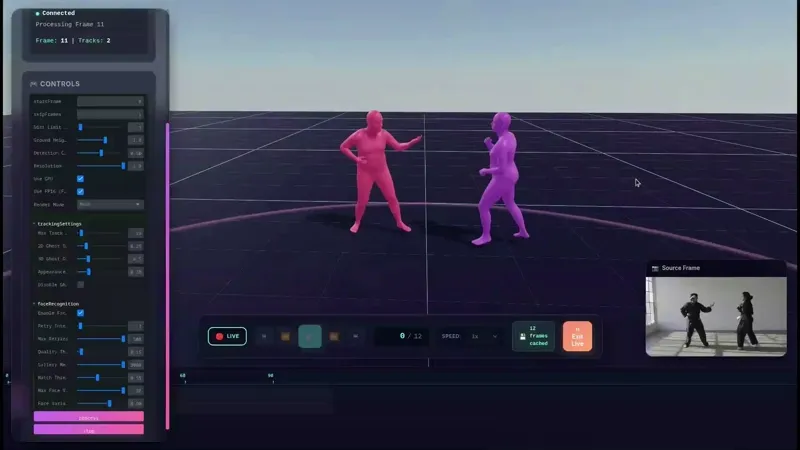
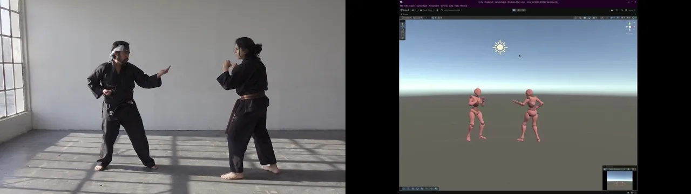

# Mo=Cat Studio

<p align="center">
  
</p>

AI-powered motion capture studio for multi-person 3D body tracking from video.

**Get `.glb` mocap animation files from smartphone-captured videos.**

> **Note**: This project has only been tested on Linux.

## Overview

Mo=Cat Studio uses Meta's SAM 3D Body model to perform markerless motion capture from ordinary video files. The system tracks multiple people simultaneously, maintaining their identities across frames even through occlusions and re-appearances.

## Features

- **Multi-person tracking**: Track multiple individuals simultaneously with persistent identity
- **3D pose estimation**: Full body mesh reconstruction with 70+ joint positions
- **Face recognition**: Re-identify people who leave and re-enter the frame
- **Camera motion compensation**: Handles moving cameras using ORB feature matching
- **Ghost suppression**: Prevents duplicate detections of the same person
- **Export to GLB**: Animated 3D meshes with skeleton data
- **Real-time 3D Viewer**: Built with [Three.js](https://threejs.org/) for interactive visualization

## Preview

**Note**: *The demo video below has been sped up (10min → 10s).*

 

## Result




## How It Works

### Detection Pipeline

1. **SAM 3D Body**: Each frame is processed by Meta's SAM 3D Body model, which predicts:
   - 3D body mesh vertices
   - 70 joint positions (body, hands, face)
   - Camera-relative translation
   - Body pose parameters (MHR format)

### Multi-Person Tracking

The tracker maintains identity across frames using multiple signals:

1. **Bounding Box IoU**: Overlap between predicted and detected boxes
2. **Pose Similarity**: Comparison of normalized joint positions (10 key joints)
3. **Color Histograms**: HSV histograms from torso (upper 60% of body) and face regions
4. **3D Distance**: Euclidean distance in camera space when available
5. **Hungarian Algorithm**: Optimal assignment minimizing combined cost

### Camera Motion Compensation

The `CameraTracker` compensates for moving cameras:
- Detects ORB features in background regions (excluding person bounding boxes)
- Matches features between consecutive frames
- Estimates essential matrix and recovers camera pose
- Adjusts predicted bounding boxes to account for camera movement

### Ghost Suppression

Prevents duplicate detections (e.g., reflections, shadows):
- Checks unmatched detections against matched ones
- Requires BOTH similar pose (joint distance < 0.3) AND similar appearance (histogram distance < 0.3)
- Only suppresses when both conditions are met to avoid removing real people

### Face-Based Re-Identification

When a person leaves and re-enters the frame:
- Face embeddings are extracted using InsightFace
- Lost tracks are stored in a "gallery" for configurable time
- New tracks are matched against gallery using cosine similarity
- Tracks can be merged retrospectively when matches are found

## Running the Project

### Prerequisites

- Linux (tested on Ubuntu)
- Python 3.11+
- CUDA-capable GPU (recommended)
- Node.js/Bun for frontend

### Backend

```bash
cd backend

# Install dependencies
uv sync

# Run server
uv run uvicorn main:app --host 0.0.0.0 --port 8001
```

### Frontend

```bash
cd frontend

# Install dependencies (using bun)
bun install

# Run development server
bun run dev --host
```

The frontend will be available at `http://localhost:5173` and will connect to the backend at `http://localhost:8001`.

## Configuration

The tracking parameters can be adjusted from the frontend UI:
- **Ghost Threshold**: How close detections must be to be considered duplicates
- **Max Age**: Frames to keep lost tracks before deletion
- **Face Match Threshold**: Minimum similarity for face-based re-identification
- **Distance Limit**: Maximum camera distance to track (meters)

## License & Credits

This project includes code from [SAM 3D Body](https://github.com/facebookresearch/sam-3d-body) by Meta Platforms, Inc., licensed under the [SAM 3D Body License](backend/sam_3d_body/LICENSE).

### SAM 3D Body Citation
```bibtex
@article{ponttuset2024sam3d,
  title={SAM 3D Body: Segment Any 3D Human},
  author={Pont-Tuset, Jordi and Zheng, Higgins and others},
  journal={arXiv preprint},
  year={2024}
}
```

**Modifications to SAM 3D Body:**
- Removed unused `visualization/` module
- Removed notebook helpers

The `tracker` and `tools` modules are custom code built on top of SAM 3D Body.

The rest of this project (frontend, backend integration, and custom logic) is licensed under the GPL-2.0 License.

**Logo**: Generated by [Google Nano Banana](https://gemini.google/overview/image-generation/)

**Development**: This project was developed with assistance from LLMs.

**Video**: Video by [RDNE Stock project](https://www.pexels.com/video/man-and-woman-training-martial-arts-7045146/)
